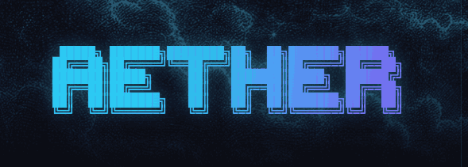
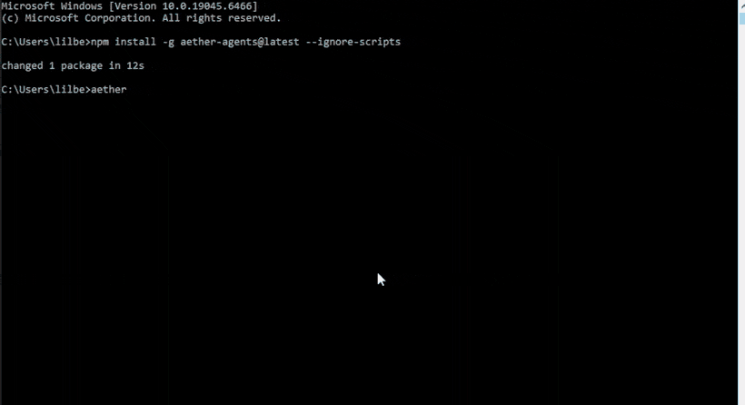
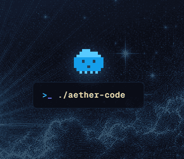

<div align="center">



# Aether Agent

**A coding agent that lives in your terminal.**

It reads your repository, makes the change, runs the checks you name,
and shows you the exit code. Hosted models or your own local Ollama.

[](https://github.com/AetherAI3/aether-agent/actions/workflows/ci.yml)
[](https://www.npmjs.com/package/aether-agents)
[](https://pypi.org/project/aether-agent/)
[](https://nodejs.org/)
[](LICENSE)

[Quickstart](#quickstart) · [Models](#pick-where-the-model-runs) · [Commands](#commands) · [Aether Code](#aether-code-on-the-web) · [Safety](#what-stays-on-your-machine) · [Patch notes](#versions-and-patch-notes)

<br />



<sub>Install → launch → `/help` → `/models`. That's the whole first run.</sub>

</div>

<!-- SOURCE-0.3-WORKFLOWS:START -->

> **Requires 0.3.2 or newer.** Check what you have with `aether --version`.

## Quickstart

Run these from inside the repository you want Aether to work on:

```bash
npm install -g aether-agents@latest --ignore-scripts
aether auth login
aether agent --test-cmd "npm test" "fix the failing test"
```

That last line is the whole idea: **one task, one way to prove it worked.**
Aether makes the edit, your machine runs `npm test`, and the real exit code
decides whether the run is verified. No exit code, no claim.

Prefer Python? `pipx install aether-agent` installs the same CLI and forwards
every command to it, so `aether-agent code "..."` and `aether code "..."` do the
same work. See [`packages/pypi-cli`](packages/pypi-cli/README.md).

## Pick where the model runs

Both routes keep your files, your permissions, and your verification on your
machine. The only thing that moves is where the model thinks.

### Hosted — sign in and go

```bash
aether auth login
aether models
```

Your task and the context you hand over go to the Aether API. Repository tools
and checks still run in your checkout. If the service can't honour that
local-authority contract, the run stops rather than quietly moving your tools
to a server.

### Local — no account needed

Install [Ollama](https://ollama.com/), start it, then:

```bash
aether setup --local
aether local pull qwen2.5-coder:7b --yes
aether local use qwen2.5-coder:7b --yes
aether agent --local --test-cmd "npm test" "fix the failing test"
```

Once Ollama and the model are downloaded, inference can stay on the machine.
The default endpoint is loopback; if `OLLAMA_HOST` points elsewhere, prompts go
there instead. Network tools stay separate and permissioned either way.

## Model catalogue

What your account can actually reach is whatever `aether models` prints while
you are signed in. The snapshot below is a dated reference, published so the
list is readable without signing in first.

<!-- MODEL-CATALOGUE:START -->
A dated, sanitized offline fallback snapshot is available as [HTML](docs/model-catalogue/index.html), [JSON](docs/model-catalogue/catalogue.json), and [Markdown](docs/generated/model-catalogue.md). It was generated at `2026-08-23T00:00:00.000Z` from Cloud public projection `model-catalogue-v1` with verified digest `sha256:80ba3ba1144d301e2cca407ceced74cb2b371f1da6e3982b87305ff12a3d4712`. Listed availability is not an account entitlement; use `aether models` while signed in.
<!-- MODEL-CATALOGUE:END -->

Local Ollama is independent of all of it — you get whatever you have installed
at your configured endpoint.

## What you get

- **One terminal workflow.** Task, diff, tests, and review in the same place you
  already work.
- **Proof, not claims.** `--test-cmd` ties "done" to a command and an exit code.
  Change the repo afterwards and that evidence goes stale on purpose.
- **Repo-aware tools.** File, search, shell, Git, session, and review tools
  scoped to the workspace you chose — not your whole machine.
- **Work you can pick back up.** Sessions are project-scoped: list them, resume
  one, or hand it off as a redacted bundle.
- **MCP built in.** Inspect, diagnose, and repair configured MCP servers without
  stepping around tool permissions.

## Commands

| Command | What it does |
|---|---|
| `aether auth login` | Sign in for hosted models. |
| `aether agent [task]` | Run the coding agent, or open its REPL. |
| `aether agent --local [task]` | Same, through your Ollama endpoint. |
| `aether models` | Show the hosted models your account can see. |
| `aether local doctor\|models\|use\|pull` | Diagnose and manage local Ollama. |
| `aether sessions` | Inspect and continue project-scoped sessions. |
| `aether review` | See the changes and the current verification evidence. |
| `aether mcp` | List, diagnose, or repair MCP servers. |
| `aether doctor` | Check the environment. |
| `aether ship` | Preview and approve a branch and pull request. |

`aether help <command>` has the details, or read the generated
[command reference](docs/generated/commands.md) for every flag, slash command,
environment variable, and exit code.

<!-- SOURCE-0.3-WORKFLOWS:END -->

## Aether Code on the web

<div align="center">

</div>

[**Aether Code**](https://app.aethersystems.net/) is the browser surface for the
same Aether account — one of three apps on the portal, alongside Web Chat and
Design Lab. Sign in once, then pick where you want to work that day.

Aether Code and Aether Agent are deliberately separate products. The CLI is
standalone and open source: on the local route it needs no Aether account at
all, and it makes no claim to hand a session back and forth with the web app.

### Coming next: live session viewing

Remote viewing — /rc — is the bridge between the terminal and the browser, and
it is being integrated now. The host lives in
[PR #108](https://github.com/AetherAI3/aether-agent/pull/108) and is **not part
of 0.3.x**, so nothing below is something you can run yet. What it will do:

- Starting a session prints a link and a QR code.
- Your phone or browser **watches** the run. It never gets tool authority.
- One command shows what is exposed; another revokes it.
- Outbound TLS only — no inbound listener on your machine.
- Events are allowlisted and redacted: no environment variables, credentials,
  cookies, private memory, raw file contents, absolute paths, or unredacted
  shell history.
- If the broker drops, your local session carries on regardless.

Those are release requirements, not goals — which is why the work is still open
rather than shipped.

## What stays on your machine

- **Files stay in the workspace.** File tools are confined to the workspace you
  selected, and writes, shell, Git, network, and publishing each pass a
  host-side permission gate.
- **Hosted runs send only what you hand over.** Your task and context go to the
  Aether API; repository tools and checks run in your checkout, and the
  local-authority route fails closed rather than quietly degrading.
- **Local runs stay local.** Ollama prompts go to your configured endpoint,
  which is loopback by default.
- **Secrets live outside the repository.** So do session records. Portable
  handoffs drop transcripts, file contents, shell commands, and absolute paths —
  still give one a read before you share it.
- **Publishing is never implicit.** `aether ship` prints its branch, commit,
  destination, and pull-request plan before it acts, and `--yes` on its own is
  not publication authority.

[SECURITY.md](SECURITY.md) has the supported versions, the full boundary, and
the private path for reporting a vulnerability.

## Versions and patch notes

The repository and the published package are versioned independently.

| Install | Version | What it is |
|---|---:|---|
| npm `latest` | [](https://www.npmjs.com/package/aether-agents) | The published package; the badge resolves the live dist-tag. |
| PyPI `aether-agent` | [](https://pypi.org/project/aether-agent/) | A launcher that installs and runs the npm CLI. It follows npm `latest` unless you pin one. |
| `main` source build | **0.3.2** | This repository's source: the 0.3 workflow plus every 0.3.1 maintenance fix. |

- **[Release notes](RELEASE_NOTES.md)** — one entry per release, in plain language.
- **[Patch-note log](docs/releases/README.md)** — one dated file per release day,
  one sentence per pull request, plus the operator packet that records the exact
  commit, tarball digest, and evidence behind each tag.
- **[Releases and tags](https://github.com/AetherAI3/aether-agent/releases)** —
  every published version.

## Build from source

Node.js 24 or newer:

```bash
git clone https://github.com/AetherAI3/aether-agent.git
cd aether-agent
npm ci --ignore-scripts
npm run build
npm link
```

## Development

```bash
npm ci --ignore-scripts
npm run typecheck
npm test
npm run smoke
npm run verify:production
npm run docs:check
npm run release:truth
npm pack --dry-run
```

The package has no runtime dependencies — TypeScript and Node types are
development-only. Read [CONTRIBUTING.md](CONTRIBUTING.md) before opening a pull
request, and see the [architecture and protocol docs](docs/) or
[production operations](docs/PRODUCTION_OPERATIONS.md) if you are going deeper.

## Help and license

Bugs and feature requests go to
[GitHub issues](https://github.com/AetherAI3/aether-agent/issues). Security
reports use the private path in [SECURITY.md](SECURITY.md).

Apache-2.0 — use it, fork it, ship it. The license covers the code, not the
Aether name or the hosted service ([LICENSE](LICENSE) · [NOTICE.md](NOTICE.md)).
