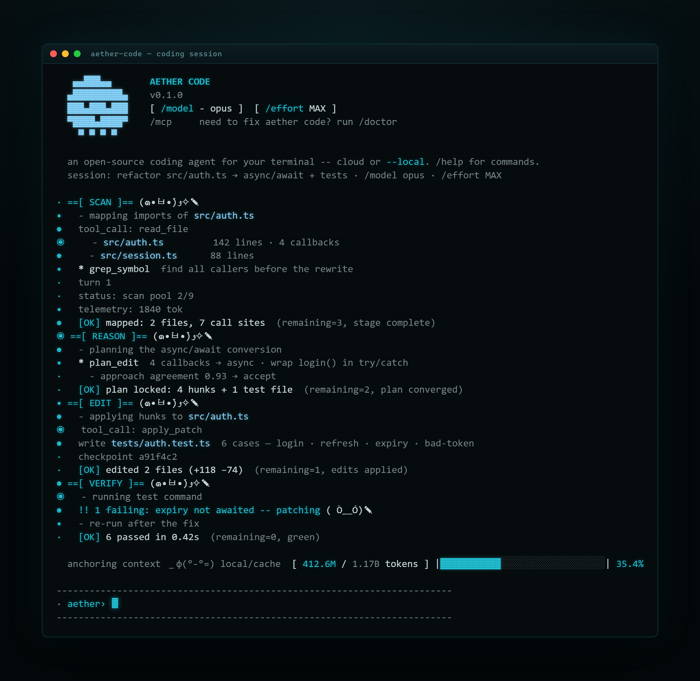

<div align="center">

# Aether Agent

**An open-source coding agent for your terminal — runs on hosted frontier models or fully offline on your own machine.**

[](LICENSE) [](https://nodejs.org) [](https://aethersystems.net)

```bash
npm i -g aether-agent     # or run once: npx aether-agent
```

</div>



---

## What it is

Aether Agent reads your code, plans, edits files, runs your tests, and fixes what broke — right in your terminal, showing its work as it goes. Like Claude Code or Aider, but with two differences that matter:

- **Model-agnostic.** Sign in to use Aether's hosted fleet (Claude, GPT, DeepSeek, Kimi, Gemma + the **Neo** and **Kronus** orchestrators) — or run `--local` on **Ollama** with no account and no network at all.
- **Verification is ground truth.** When a run finishes, the host runs *your* test command itself and reads the exit code. A green result means your tests actually passed — it's never the model's word for it.

Either way it's a thin client: edits apply to **your** files on **your** disk, path-guarded. Your repository is never uploaded.

## Quickstart

```bash
npm i -g aether-agent                # needs Node >= 20

# Path A — hosted models (sign in once):
aether auth login                    # authorize at aethersystems.net
aether agent "refactor src/auth.ts to async/await and add tests"

# Path B — fully local, no account, no network:
ollama pull qwen2.5-coder:7b
aether agent --local "same task, offline"
```

No account? Create one free at **[aethersystems.net](https://aethersystems.net)** — the free tier covers Haiku and fast models; paid tiers unlock Opus, the premium models, and the orchestrators. Or skip it entirely and stay `--local`.

> **Other installers:** `curl -fsSL https://aethersystems.net/install.sh | sh` (macOS/Linux/WSL) · `irm https://aethersystems.net/install.ps1 | iex` (Windows PowerShell). They just verify Node and run the npm install — no native deps, no daemon.

## Three ways to run it

```bash
aether                                 # interactive REPL — chat + /slash commands
aether "explain src/router.ts"         # one-shot answer, then exit
aether agent "fix the failing tests"    # autonomous agent: edits files + verifies
```

## Two brains, one terminal

The agent runs on either brain through the **same** host loop, render, tools, and commands — so local and hosted behave identically. Switching just swaps the transport.

| | **API** (default) | **Local** (`--local`) |
|---|---|---|
| Runs on | Aether's hosted API | your machine, via Ollama |
| Models | full Aether fleet + Neo / Kronus | any Ollama model you've pulled |
| Login | your Aether account | none — fully offline |
| Your code | stays local; only the prompt + context you send leaves | never leaves the machine |
| Metering | UVT usage meter + signed receipts | none — it's your hardware |

```bash
aether agent "refactor src/auth.ts"            # API brain
aether agent --local "refactor src/auth.ts"    # local brain
```

## Models

**API models** (sign in). Frontier and fast models served by the Aether platform — your exact roster depends on your plan, so the live source of truth is the `aether models` command:

```bash
aether models                  # every model + orchestrator on your tier
aether models use sonnet       # set your default
```

| Provider | Models | Tier |
|---|---|---|
| Anthropic | Claude (Haiku · Sonnet · Opus) | Haiku free · Sonnet/Opus paid |
| OpenAI | GPT | paid |
| DeepSeek | DeepSeek | free + paid |
| Moonshot | Kimi | paid |
| Google | Gemma | free + paid |
| **Orchestrators** | **Neo** (plans + fans out sub-agents) | Solo+ |
| | **Kronus** (deep multi-agent audits) | Pro+ |

```bash
aether run neo "add pagination to the users endpoint and write tests"
aether run kronus "audit this service for race conditions and fix them"
```

**Local models** (`--local`). The same terminal driving a headless Python brain on the [Unlimited Context](https://github.com/DBarr3/Unlimited-Context) engine, inferring through Ollama — no account, no network.

| Local model | Size | Notes |
|---|---|---|
| `qwen2.5-coder:7b` | ~4.7 GB | Universal default — fits an 8 GB GPU, best small-model tool use. |
| `gemma3:4b` | ~3.3 GB | Lighter option (`gemma3n:e4b` for the efficient variant). |
| `qwen3-coder:30b` | ~24 GB | For depth — needs ~24 GB RAM/VRAM. |

```bash
ollama pull qwen2.5-coder:7b
aether agent --local --model qwen3-coder:30b "add a retry with backoff to the fetch helper"
```

## Common commands

```bash
aether agent [flags] "<task>"     # the autonomous agent (see flags below)
aether models                    # list models + orchestrators
aether auth login                # sign in for the API path
aether resume                    # replay / continue the last session (offline)
aether config set defaultModel opus
```

| `aether agent` flag | What it does |
|---|---|
| `--local` | Use the local Python/Ollama brain instead of the API. |
| `--model <id>` | Force a model (e.g. `--model opus`, or an Ollama tag with `--local`). |
| `--effort <tier>` | Budget ceiling: `LOW` · `MED` · `MAX` · `ULTRA` · `CODEPRO`. |
| `--test-cmd <cmd>` | Command the verification gate runs (default `pytest -q`). |
| `--worktree` | Run in a fresh git worktree on an auto-named branch (isolated). |
| `--repo <owner/name>` | Clone a GitHub repo via your own `gh`/`git` auth, work it in a worktree. |
| `--interactive` | Pause at each stage boundary to type a steer (TTY only). |
| `-y`, `--yes` | Auto-confirm prompts (non-interactive). |

Inside the REPL, `/` commands control the session: `/model` · `/models` · `/agent` · `/tier` · `/audit` · `/doctor` · `/help` · `/exit`.

**Full reference:** every command, flag, slash command, and env var lives in [COMMANDS.md](COMMANDS.md).

## Security

- **Your code stays local.** Edits apply on your machine, path-guarded — the client refuses to write outside your working directory. On the API path only the prompt and context you send leave; on `--local`, nothing leaves at all.
- **Verification is ground truth.** The host runs your test command and reads the exit code itself; "done" is never the model's word.
- **Tokens are credentials.** Stored `chmod 600`, never committed; `aether auth logout` clears them.
- **The server is the authority.** On the API path, usage limits, model access, and signing (chain-of-custody receipts) are enforced server-side — the client only displays what the server reports.

Found a vulnerability? See [SECURITY.md](SECURITY.md).

## Embed the core

The CLI is a thin terminal frontend over a small, typed client. Import it and route any surface — desktop app, web chat, your own tool — through the same path.

```ts
import { createClient } from "aether-agent";

const aether = createClient({ token: process.env.AETHER_TOKEN });

for await (const frame of aether.chatStream("Summarize this diff", { model: "sonnet" })) {
  if (frame.type === "delta") process.stdout.write(frame.text);
}

const { models } = await aether.catalog();   // same /models menu, one source
```

The headless-brain ↔ host event protocol is documented and open — see [docs/BRIDGE_PROTOCOL.md](docs/BRIDGE_PROTOCOL.md).

## Part of the Aether platform

Aether Agent is the **terminal sibling** of **[AetherCloud](https://github.com/DBarr3/aethercloud)**, the agentic desktop app — same login, same UVT balance, same model fleet. Drive your repo from the command line; drive projects, workflows, and the memory Vault from the desktop. **One account runs both,** and your balance and context follow you across terminal, desktop, and your Aether AI on the web.

## License

Apache-2.0 — use it, fork it, ship it. The license covers the code, not the Aether name or hosted service ([LICENSE](LICENSE) · [NOTICE.md](NOTICE.md)). PRs and issues welcome — see [CONTRIBUTING.md](CONTRIBUTING.md).

---

<div align="center">

Built by **Aether AI** · [aethersystems.net](https://aethersystems.net)

*One terminal. Frontier models or fully local. Your code stays yours.*

</div>
