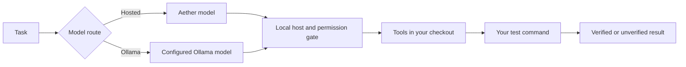

<div align="center">

# Aether Agent

**A terminal coding agent built around verifiable results and portable work.**

[](https://github.com/AetherAI3/aether-agent/actions/workflows/ci.yml)
[](https://www.npmjs.com/package/aether-agents)
[](https://nodejs.org/)
[](LICENSE)

[Install](#install-the-right-version) · [Hosted or Ollama](#hosted-or-ollama) · [Workflow](#a-verified-coding-workflow) · [Handoffs](#continue-on-another-model-or-machine) · [Commands](#essential-commands) · [Security](#security-and-permissions) · [Develop](#development)

</div>

Aether Agent is an open-source TypeScript CLI for coding, testing, review, and
handoff. Use Aether-hosted models when the required local-authority service
capability is available, or run through Ollama without an Aether account. The same
local host owns workspace tools, permissions, sessions, review, and verification.

## Install the right version

Two surfaces exist at once: the package published to npm, and the `main` source
build in this repository. Publishing is an owner-controlled operation, so source
presence is not registry availability, and the two can hold different versions.

| Install | Version | What you get |
|---|---:|---|
| npm `latest` | [](https://www.npmjs.com/package/aether-agents) | Whatever that badge resolves to right now — it tracks the live `latest` dist-tag. |
| `main` source build | **0.3.0** | The 0.3 coding, Ollama, session, review, and ship workflows below. |

> **Confirm your version before following a version-labelled section.** Run
> `npm view aether-agents version` for the live `latest` dist-tag, and
> `aether --version` for what you actually have installed. Sections marked
> “source 0.3.0” require **0.3.0 or newer**; if your installed version is lower,
> use the source build below. The
> [release record](docs/releases/2026-08-22.md) and
> [operator packet](docs/releases/OPERATOR-PACKET-v0.3.0.md) preserve the evidence.

Install from npm:

```bash
npm install -g aether-agents@latest --ignore-scripts
aether --version
```

If that reports **0.3.0 or newer**, every section below applies. If it reports an
earlier version, npm has not caught up with `main` yet — sign in, inspect models,
and use chat, then build from source for the rest:

```bash
aether auth login
aether models
aether chat "hello"
```

<!-- SOURCE-0.3-WORKFLOWS:START -->

> **Requires 0.3.0 or newer**, from npm or from the source build below.

Node.js 24 or newer is required:

```bash
git clone https://github.com/AetherAI3/aether-agent.git
cd aether-agent
npm ci --ignore-scripts
npm run build
npm link
```

## Hosted or Ollama

Both routes use the same local host for workspace confinement, permission prompts,
tool execution, session records, review, and final verification. Only the model
transport changes.

### Hosted Aether

```bash
aether auth login
aether models
aether agent --test-cmd "npm test" "fix the failing test"
```

Hosted coding is capability- and account-dependent. The task and context you supply
are sent to the Aether API, but tools and verification execute in your checkout. If
the service cannot provide that local-authority protocol, the CLI refuses the run
instead of silently moving tool execution to the server.

<!-- MODEL-CATALOGUE:START -->
A dated, sanitized offline fallback snapshot is available as [HTML](docs/model-catalogue/index.html), [JSON](docs/model-catalogue/catalogue.json), and [Markdown](docs/generated/model-catalogue.md). It was generated at `2026-08-23T00:00:00.000Z` from Cloud public projection `model-catalogue-v1` with verified digest `sha256:80ba3ba1144d301e2cca407ceced74cb2b371f1da6e3982b87305ff12a3d4712`. Listed availability is not an account entitlement; use `aether models` while signed in.
<!-- MODEL-CATALOGUE:END -->

### Ollama

Install [Ollama](https://ollama.com/), start its app or server, then select a model:

```bash
aether setup --local
aether local pull qwen2.5-coder:7b --yes
aether local use qwen2.5-coder:7b --yes
aether agent --local --test-cmd "npm test" "fix the failing test"
```

This route requires no Aether account. By default it talks to Ollama on
`http://localhost:11434`; if you configure `OLLAMA_HOST`, requests go to that
endpoint. Pulls and configuration changes show a plan and require confirmation.

## Why Aether Agent

- **Evidence, not confidence.** The host reruns the command supplied through
  `--test-cmd`; its real exit code determines the verified result. Without one, the
  run is recorded as unverified.
- **One workflow across model routes.** Switching between hosted and Ollama changes
  the brain, not the host that owns tools, permissions, sessions, and verification.
- **Work that can move.** Export a bounded continuation record and resume it in
  another checkout, on another machine, or with another model.
- **Review before publication.** Inspect the measured repository state and its
  verification status before `aether ship` proposes a push and pull request.

## A verified coding workflow



```bash
aether agent --test-cmd "npm test" "fix the failing test"
aether review diff
```

The verification record is bound to the repository state. If the tree changes after
verification, review and ship report the evidence as stale instead of reusing an old
green result. `aether ship` prints the branch, commit, destination, and pull-request
plan before acting; `--yes` alone does not grant publication authority.

## Continue on another model or machine

```bash
aether resume export --out aether-handoff.json
aether agent --resume aether-handoff.json --model <model-id>
```

A handoff is a bounded continuation record, not a transcript or repository copy. It
can include the task, prior model, verification result and command, repository
identity, touched paths, and summarized highlights. It omits file contents, shell
commands, absolute paths, and the full conversation. Review it before sharing:
bounded does not mean secret-free.

## In the 0.3 source line

Coding runs, hosted and Ollama routing, verified completion, project sessions,
portable handoffs, review and ship, skills and capability reporting, doctor and
support bundles, MCP, workflows, previews, and media commands.

Detailed inventories live in the generated
[command reference](docs/generated/commands.md) and
[model catalogue](docs/generated/model-catalogue.md). Hosted model visibility and
entitlement remain account- and service-dependent; `aether models` is authoritative
for the signed-in account.

## Essential commands

| Command | Purpose |
|---|---|
| `aether agent [task]` | Start the coding agent or its REPL. |
| `aether agent --local [task]` | Use the configured Ollama endpoint. |
| `aether models` | Show models visible to the signed-in account. |
| `aether resume` | Replay a session or export a portable handoff. |
| `aether review` | Inspect changes and current verification status. |
| `aether ship` | Preview and approve branch and pull-request publication. |
| `aether doctor` | Diagnose the configured environment. |

Use `aether help <command>` or the generated
[command reference](docs/generated/commands.md) for flags, slash commands,
environment variables, and exit codes.

<!-- SOURCE-0.3-WORKFLOWS:END -->

## Security and permissions

- File tools are confined to the selected workspace. Write, shell, Git, network,
  and publishing actions pass through host permission gates.
- Hosted tasks and supplied context are sent to the configured Aether API. The
  local-authority coding route refuses incompatible server execution.
- Ollama requests are sent to the configured Ollama endpoint. Network-capable tools
  remain separate, permissioned actions.
- Credentials and session records live outside the repository. Handoffs omit the
  transcript and repository contents, but should still be reviewed before sharing.

Read [SECURITY.md](SECURITY.md) for vulnerability reporting and supported versions.
Protocol and architecture contracts live under [`docs/`](docs/). Other Aether web
and desktop products are separate surfaces; this CLI does not claim cross-product
session continuation.

## Development

```bash
npm ci --ignore-scripts
npm run typecheck
npm test
npm run smoke
npm run verify:production
npm run docs:check
npm run release:truth
npm pack --dry-run
```

See [CONTRIBUTING.md](CONTRIBUTING.md) before opening a pull request. Security issues
follow [SECURITY.md](SECURITY.md), not the public issue tracker. The package has no
runtime dependencies; TypeScript and Node types are development-only.

Apache-2.0 — use it, fork it, and ship it. The license covers the code, not the
Aether name or hosted service ([LICENSE](LICENSE) · [NOTICE.md](NOTICE.md)).
