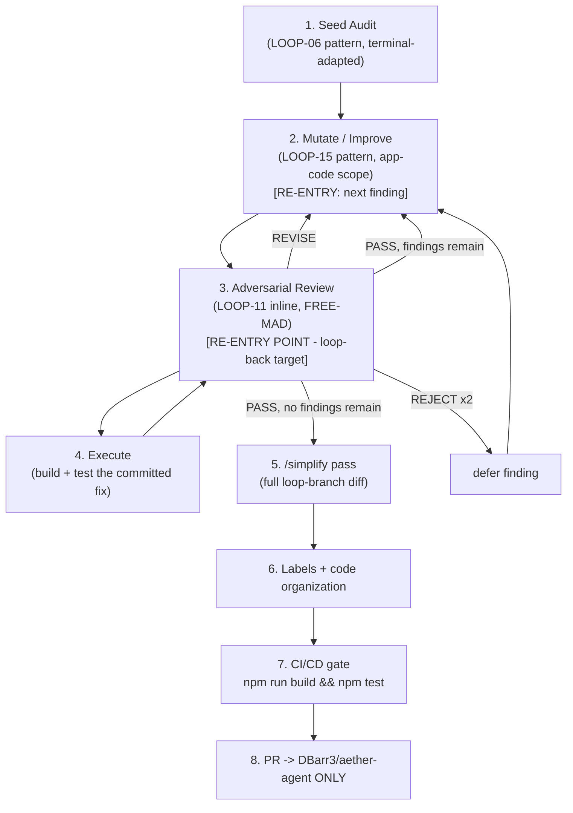

# Mission

Close the terminal UX/UI findings in `aether-agent` (`src/ui/*`, `src/commands/*`,
`src/core/render.ts`) through a tight, re-entrant cycle instead of a one-shot audit
patch. The loop seeds from a real UX/UI sweep (LOOP-06 pattern, adapted for a TUI —
no browser, no viewports/themes; PTY/state-driven instead of Playwright), then for
every open finding runs a **mutate → adversarial-review → execute** micro-cycle
where the review node is the loop's re-entry point: a rejected fix goes back to
mutate, an executed fix goes back to review for re-verification, and only a clean
review advances to the next finding. This mirrors the Kernel's own workflow-recovery
rule (§7: "Node 11 fails → resume at node 11, never node 1") — here that rule *is*
the loop's control flow, not just its failure path. Every mutation lands on a loop
branch, every fix carries a regression test, and nothing merges without a green
build+test suite, a `/simplify` pass, and operator sign-off.

# Trigger (when the operator runs this)

- On demand: `Run AA-LOOP-01 on aether-agent (scope: src/ui/)`.
- After any change to `src/ui/*`, `src/commands/*`, or `src/core/render.ts` that
  wasn't itself produced by this loop (re-seed and diff against the last run).
- Pre-release, alongside the repo's existing `npm test` gate.

# Inputs (target repo/dir, scope flags)

- `target`: `aether-agent` repo root (`https://github.com/DBarr3/aether-agent`).
- `scope`: default `src/ui/*, src/commands/*, src/core/render.ts`; operator may narrow.
- `seed_corpus`: `docs/reviews/2026-06-10-terminal-ux-sweep.md` — the existing 21-item
  P0/P1/P2 sweep. **Not trusted blindly**: Node 1 re-verifies every item against
  current `HEAD` before treating it as OPEN (items #1–4 note PR #22 already fixed
  pager reflow/cursor/sanitizing/animation wiring; commit `9b83d55`, "repo-wide
  cleanup," post-dates the sweep and may have touched more).
- `--only <P0|P1|P2>`: severity filter.
- `--finding <n>`: restrict to a single seed-corpus item (re-run/resume use case).
- `--no-mutate`: findings + re-verification only, no fixes.

# Preconditions

- Loop branch `loop/AA-LOOP-01-<YYYY-MM-DD>` created from `origin/main` — never
  from an in-progress branch like `chore/repo-cleanup-audit`.
- Baseline green: `npm install && npm run build && npm test` passes on `main`
  before Node 1 starts. This repo has no GitHub Actions (`.github/` does not
  exist) — the test suite *is* the CI/CD gate (per `CONTRIBUTING.md`: "Tests
  pass. `npm test` is green before you open a PR").
- No runtime dependency additions without a maintainer's nod (`CONTRIBUTING.md`
  — zero-runtime-dep is a stated feature of this repo).
- No secrets/tokens/internal hostnames introduced (`CONTRIBUTING.md`); guard
  every commit.
- `aether-agent` is a local CLI, not a server — this loop has **no infra-touching
  surface**; risk-class is `branch-mutating` only.

# Execution DAG (numbered nodes, [P] = parallelizable)



1. Seed audit and re-verification (LOOP-06 pattern, terminal-adapted).
2. **[loop re-entry A]** Mutate/Improve — pick next OPEN finding, apply fix + regression test.
3. **[loop re-entry point — B]** Adversarial Review — critique the fix (FREE-MAD, inline).
4. Execute — build + test the committed fix, then hand back to node 3.
5. `/simplify` pass over the full loop-branch diff.
6. Labels + code-organization pass.
7. CI/CD gate — full build+test suite.
8. PR — opened against `aether-agent` only.

**The loop-back edge is 4 → 3, never 4 → 1 and never 4 → 2 directly.** Node 3 is
the sole controller of what happens next: it either sends control back to node 2
(revise-in-place, or advance to the next finding) or forward to node 5. This is
deliberate — re-verification always happens before any routing decision, so a fix
that "looks executed" is never assumed correct.

# Node Specs

**Node 1 — Seed audit + re-verification.**
Action: load `docs/reviews/2026-06-10-terminal-ux-sweep.md`; for each of its 21
items, re-check against current `HEAD` (read the cited `file:line`, confirm the
described behavior still exists) and classify `OPEN | FIXED | STALE-SUPERSEDED`.
Then run one fresh recon pass over the declared scope for anything the original
sweep's four parallel passes didn't cover (same discipline: every claim verified
against source before inclusion, no live-driving assumptions). Terminal-adapted
LOOP-06 substitutions: no Playwright/viewports/themes; state coverage (hover/focus
equivalents = key-binding reachability, spinner liveness, cursor placement) is
verified by static read plus, where static reading is insufficient to confirm
runtime behavior (e.g. spinner liveness, resize reflow), a scripted PTY drive
(`node-pty` spawning `dist/src/main.js`, feeding key sequences, capturing raw
output) — never a bare assumption. Memory-transparency-panel check (LOOP-06 node
5): `aether-agent` has no persistent cross-session AI memory feature — record
`N/A` with the one-line reason, not silence.
Tools: Read, Grep, ast-grep equivalent (TS AST), `node-pty` (optional, PTY drive),
`npm test`.
Failure conditions: seed corpus unreadable/missing → HALT, cannot seed from
nothing; >50% of seed items already FIXED → still proceed, but flag corpus as
stale for the operator (informational, not a halt).
Output artifact: `_loopstate/AA-LOOP-01/<run-id>/node-1-findings.md` — table of
`id | source (seed|fresh) | severity | file:line | status | evidence` + QOPC.

**Node 2 — Mutate / Improve.**
Action: take the next OPEN finding in severity order (P0 → P1 → P2, matching the
seed corpus's own ordering); propose the minimal fix; apply it on the loop branch;
write a regression test that fails on the pre-fix code and passes after (per
`CONTRIBUTING.md`'s TDD bar — "match that bar"). This generalizes LOOP-15's
mutate/improve mechanic (root-cause → fix → generalized pattern) but the mutation
surface here is **application code** (`src/ui/*`, `src/commands/*`), not loop
specs — a deliberate scope difference from the source LOOP-15, whose mutation
surface is restricted to loop files only.
Tools: Read, Edit, Write (test file), Bash (`npm run build`, `node --test`).
Failure conditions: fix requires a new runtime dependency → HALT node, surface to
operator (needs maintainer nod per `CONTRIBUTING.md`); fix touches a file that
crosses the ~300-line guideline → flag for node 6, don't block here.
Output artifact: one commit (`loop(AA-LOOP-01): node-2 — <finding-id> — <change>`
+ QOPC in body) + `node-2-fix-<finding-id>.md` (finding id, diff summary, new test
path).

**Node 3 — Adversarial Review (re-entry point).**
Action: FREE-MAD, inline mode, hostile persona (see Adversarial Check below).
Attacks the QOPC `unknown` list first, then: does the new test actually reproduce
the original bug (run it against the pre-fix commit — it must fail there); does
the fix regress any of the other 20 seed-corpus items (cross-check, not just the
one in scope); is severity classification honest. Produces PASS | REVISE | REJECT
against the finding's own completion criteria (bug no longer reproducible, test
proves it, no adjacent regression).
Tools: Grep/ast-grep (this repo has no graphify MCP), Read, Bash (re-run the new
test against pre-fix and post-fix commits).
Failure conditions: reviewer cites no evidence → critique void, forces one more
round (silent-agreement guard); REJECT twice on the same finding → defer, log to
governance, advance to node 2 for the *next* finding.
Output artifact: `node-3-review-<finding-id>-round-<n>.md` (verdict, score, cited
evidence) + QOPC.

**Node 4 — Execute.**
Action: run `npm run build && npm test` against the state node 2 committed.
Green → hand back to node 3 for re-verification of the executed result (not just
the proposed diff — the actual build/test outcome). Red → classify per the
Kernel's failure taxonomy and route (Syntax Failure → auto-fix + retry; Logic
Failure → back to node 2 with the failure as critique; anything else → per
taxonomy).
Tools: Bash (`npm run build`, `npm test`).
Failure conditions: build/test failure not resolved in 3 retries → REJECT this
finding's current attempt, hand to node 3 as a REJECT with the failure log as
evidence.
Output artifact: `node-4-execute-<finding-id>.md` (build log summary, test result,
git SHA).

**Node 5 — `/simplify` pass.**
Action: once node 3 reports PASS with zero findings remaining, invoke the
`/simplify` Claude Code skill over the full loop-branch diff (`git diff
origin/main...HEAD`). Quality-only pass — reuse, simplification, efficiency,
altitude cleanup across everything this loop touched. Does not hunt new bugs
(that's node 1/3's job, already done).
Tools: `/simplify` skill, Bash (`git diff`).
Failure conditions: `/simplify` proposes a change that alters behavior (not pure
cleanup) → that specific change routes back to node 2 as a new mini-finding, does
not get applied silently under the simplify banner.
Output artifact: `node-5-simplify.md` (changes applied, changes deferred with why).

**Node 6 — Labels + code organization.**
Action: (a) for every file touched, verify it still respects the repo's own
"small files, one job each, ~300 lines" guideline (`CONTRIBUTING.md`); split any
file that crossed the threshold, following the pattern already used in this repo
(`src/ui/text.ts` extraction during the frontend-ux-overhaul plan); (b) assign PR
labels: domain (`ux`, `terminal`), risk (`branch-mutating`), and one label per
severity band actually touched (`P0`, `P1`, `P2`) — this repo has no
`.github/labels.yml`, so labels are created ad hoc via `gh label create` if
missing, reusing existing label names if the repo already has any under those
names.
Tools: Read, Edit, Bash (`gh label list`, `gh label create` if needed), `wc -l`.
Failure conditions: a needed split would touch code outside this loop's declared
scope → surface to operator as a follow-up item, don't silently expand scope.
Output artifact: `node-6-organize.md` (files split, labels applied).

**Node 7 — CI/CD gate.**
Action: `npm run build && npm test` on the final loop-branch state — this is the
repo's actual and only CI/CD gate (no GitHub Actions configured). Must be green
with zero regressions against the pre-loop baseline test count.
Tools: Bash.
Failure conditions: red → HALT, do not proceed to node 8; route the failing
test(s) back to node 2 as new findings.
Output artifact: `node-7-ci.md` (full test output, pass count before/after).

**Node 8 — PR.**
Action: open a pull request against `DBarr3/aether-agent`, base `main`, from
`loop/AA-LOOP-01-<date>`. Body includes: findings table (id, severity, status),
diffs applied (commit list), tests generated, `/simplify` summary, final QOPC,
governance row. **This loop opens PRs in `aether-agent` only — it MUST NOT
create branches, commits, or PRs in `agentic-loops` or any other repository,**
even though this spec file's structure and shared vocabulary (QOPC, DAG,
Execution Protocol) are drawn from that project's Kernel; the two repos are
kept strictly separate.
Tools: Bash (`gh pr create`).
Failure conditions: node 7 not green → this node cannot run (hard dependency).
Output artifact: PR URL + `AUDIT-ARTIFACT.md` (per the standard loop artifact
shape) attached to the PR description.

# Adversarial Check (reviewer persona + what it attacks)

Persona: **ruthless terminal-UX pentester** — fusion of a UX researcher who has
watched users rage-quit a CLI and a hostile reviewer whose job is to find edge
cases, logic flaws, and regressions in every fix before it ships. Running
FREE-MAD (score-based, no forced consensus — this is a re-entrant loop-controller
node, not a rubber stamp). It attacks:

1. Every fix's regression test — does it actually fail on the pre-fix commit?
   A test that passes both before and after proves nothing; treat it as void.
2. Cross-finding regression — does fixing #4 (gradient surrogate-pair splitting)
   touch the same code path as #19 (per-char reset doubling)? Adjacent seed-corpus
   items sharing a file are checked together, not in isolation.
3. Severity honesty — is a "P1 negative UX" finding actually reachable in a way
   that makes it P0 (e.g. #6's history-discard-on-recall combined with #1's
   Ctrl+C hard-exit — a user recovering from an accidental exit loses their draft
   twice)?
4. QOPC `unknown` list first, always — non-automatable states, PTY-drive gaps,
   anything marked `N/A` at node 1.
5. Theme/width parity where relevant (e.g. #4's gradient math, #19's escape
   doubling) — a fix verified at one terminal width/color-depth only is
   incomplete; demand evidence across at least 80/120-col and truecolor/256-color.
6. Silent Agreement — a round-1 PASS with no cited file:line evidence forces one
   additional hostile round before the verdict is accepted.

Maximum 2 debate rounds per finding (protocol default), 4 hard max on contested
findings; REJECT×2 defers rather than blocking the whole loop.

# Exit Criteria (quantitative, overrides protocol §12)

- Every seed-corpus item (21) carries a final status: `FIXED-VERIFIED`,
  `STALE-SUPERSEDED`, or `OPERATOR-DEFERRED` — none left `OPEN`.
- Every fresh finding from node 1's recon pass carries the same.
- Zero unresolved P0/CRITICAL findings — a P0 can only exit as
  `FIXED-VERIFIED` or explicitly `OPERATOR-DEFERRED` with reason, never silently
  dropped.
- 100% of applied fixes have a regression test that is verified RED on the
  pre-fix commit and GREEN on the post-fix commit (node 3 requirement).
- `npm run build && npm test` green at node 7, with test count ≥ pre-loop
  baseline count (no test silently removed to pass).
- Zero files touched left over the repo's ~300-line guideline without an
  operator-flagged exception.
- `/simplify` pass completed with zero unresolved behavior-altering proposals
  smuggled in as cleanup.
- Final QOPC confidence ≥ 0.85; governance row written.
- Exactly one PR opened, targeting `DBarr3/aether-agent` — zero writes of any
  kind to `agentic-loops` or any other repository.

# Failure Routing (only deviations from protocol §4)

- **The loop's only re-entry point on any in-cycle failure is node 3** (mirrors
  the Kernel's own §7 example verbatim: "Node 11 fails → resume at node 11,
  never node 1"). A node 4 build/test failure does not restart node 2 directly —
  it reports to node 3, which decides revise-in-place vs. defer-and-advance.
- Security Failure classification (Kernel §4) applies if any fix touches auth,
  token handling, or `src/core/client.ts`'s transport layer in a way the sweep
  didn't already scope — HALT, CRITICAL artifact, human approval required
  before continuing (this loop's declared scope is UX/UI, not auth surface;
  drifting into it is itself a routing signal to stop and ask).

# Approval Gates (only deviations from protocol §10)

- Kernel/protocol defaults apply (read/audit automatic; branch-mutating work
  needs adversarial sign-off; merge is operator-only).
- **Repository boundary is a hard approval gate, not just a scope note:** node 8
  may only target `DBarr3/aether-agent`. Any accidental targeting of
  `agentic-loops` (or any repo other than `aether-agent`) is treated as a
  Permission Failure (Kernel §4) — HALT, surface to operator, never
  self-correct by silently retargeting.
- New runtime dependency proposals (node 2) always require explicit maintainer
  approval before landing, per `CONTRIBUTING.md`.

# RUN PROMPT

```
Run AA-LOOP-01 on aether-agent (scope: src/ui/, src/commands/, src/core/render.ts).
Follow C:\Users\lilbe\Documents\GitHub\aether-agent\docs\loops\AA-LOOP-01-ux-ui-mutate-adversarial.md.
Seed from docs/reviews/2026-06-10-terminal-ux-sweep.md, re-verify every item against
current HEAD before treating it as open. For each open finding: mutate/improve on
the loop branch with a regression test, then adversarial-review (FREE-MAD, hostile
terminal-UX pentester persona) before and after execution — the review node is the
sole re-entry point on revise/reject, never node 1. Repeat until every finding is
FIXED-VERIFIED, STALE-SUPERSEDED, or OPERATOR-DEFERRED. Then run /simplify over the
full diff, verify file-size/labels hygiene, confirm `npm run build && npm test`
green, and open exactly one PR against DBarr3/aether-agent (main). Never touch the
agentic-loops repository. No merge without my approval.
```
