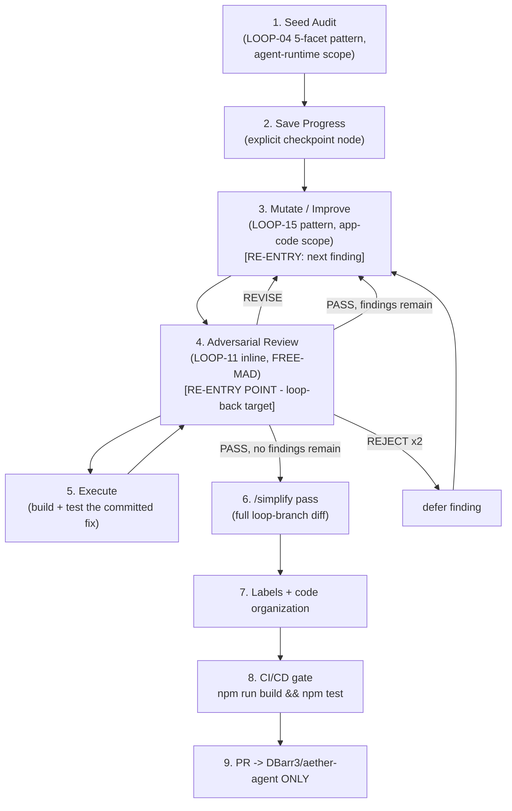

# Mission

Audit `aether-agent`'s own agentic runtime — the MCP client, the tool executor,
the autonomy/permission gate, the context registry, and the brain-protocol
envelope that carries model output back into the next turn — against the OWASP
Agentic Top 10 (LOOP-04 pattern: schema strictness, least-privilege agency,
context-management hygiene, prompt-injection surfaces, untrusted-data
boundaries), compressed into a single seed pass the way AA-LOOP-01 compressed
LOOP-06 for the terminal-UX domain. Unlike AA-LOOP-01, this loop makes the
Kernel's §7 workflow-recovery checkpoint an **explicit numbered node**: seed
findings and baseline state are written to disk before any mutation starts, so
a crash before the mutate/review cycle resumes from a persisted inventory
instead of re-scanning the runtime from zero. From there it runs the same
tight **mutate → adversarial-review → execute** micro-cycle as AA-LOOP-01, with
the review node as the sole re-entry point, then `/simplify`, labels/file-size
hygiene, the repo's real CI gate (`npm test` — no GitHub Actions here), and a
PR. The loop audits the system that grants the agent its hands; it may never
widen what those hands can reach in the process (LOOP-04's own boundary,
inherited verbatim).

# Trigger (when the operator runs this)

- On demand: `Run AA-LOOP-02 on aether-agent (scope: src/core/mcp.ts, src/core/mcp_store.ts, src/core/tool_executor.ts, src/core/autonomy.ts, src/core/verify_gate.ts, src/core/envelope.ts, src/core/context.ts, src/core/context_registry.ts, src/core/brain*.ts, src/core/orchestrator.ts, src/core/custody.ts, src/commands/mcp.ts, src/commands/workflow.ts)`.
- After any change to the MCP client, tool executor, autonomy/gate logic, or
  brain-protocol wire format that wasn't itself produced by this loop
  (re-seed and diff against the last run).
- Whenever a new tool is added to `ToolExecutor` — a new mutating capability is
  exactly the class of change `gateActionFor`'s exhaustiveness depends on (see
  Node 1c).
- Pre-release, alongside the repo's existing `npm test` gate and AA-LOOP-01.

# Inputs (target repo/dir, scope flags)

- `target`: `aether-agent` repo root (`https://github.com/DBarr3/aether-agent`).
- `scope`: default `src/core/mcp.ts, src/core/mcp_store.ts,
  src/core/tool_executor.ts, src/core/autonomy.ts, src/core/verify_gate.ts,
  src/core/envelope.ts, src/core/context.ts, src/core/context_registry.ts,
  src/core/brain.ts, src/core/brain_cloud.ts, src/core/brain_local.ts,
  src/core/brain_ollama.ts, src/core/brain_protocol.ts,
  src/core/orchestrator.ts, src/core/custody.ts, src/core/worktree.ts,
  src/core/github.ts, src/core/vault.ts, src/commands/mcp.ts,
  src/commands/workflow.ts, src/commands/run.ts, src/commands/slash.ts,
  src/commands/slash_registry.ts, src/commands/config.ts,
  src/commands/vault.ts`; operator may narrow.
- `seed_corpus`: none pre-existing for this domain (unlike AA-LOOP-01's terminal
  sweep) — Node 1 generates the seed corpus fresh from the LOOP-04 five-facet
  audit; this run's `node-1-findings.md` becomes the seed corpus for any future
  re-run.
- `--only <P0|P1|P2>`: severity filter.
- `--finding <n>`: restrict to a single seed-corpus item (re-run/resume use case).
- `--no-mutate`: findings + checkpoint only, no fixes (mirrors LOOP-04's own
  read-only-by-default posture upstream).

# Preconditions

- Loop branch `loop/AA-LOOP-02-<YYYY-MM-DD>` created from `origin/main` — never
  from an in-progress branch.
- Baseline green: `npm install && npm run build && npm test` passes on `main`
  before Node 1 starts. This repo has no GitHub Actions (`.github/` does not
  exist) — the test suite *is* the CI/CD gate (`CONTRIBUTING.md`: "Tests pass.
  `npm test` is green before you open a PR").
- No runtime dependency additions without a maintainer's nod
  (`CONTRIBUTING.md` — zero-runtime-dep is a stated feature of this repo).
- No secrets/tokens/internal hostnames introduced; guard every commit — this
  loop's own scope (MCP OAuth, vault, GitHub connect) makes this precondition
  higher-stakes than AA-LOOP-01's, not lower.
- This repo has no code-graph/knowledge-graph MCP tool of its own (AA-LOOP-01's
  precedent stands) — use TS AST reasoning (`tsc --noEmit` type info,
  `ast-grep`/structural search) and Grep for literals only, never
  grep-for-logic-comprehension (Kernel §2).
- `aether-agent` is a local CLI, not a server — no infra-touching surface;
  risk-class is `branch-mutating` only, same as AA-LOOP-01.

# Execution DAG (numbered nodes, [P] = parallelizable)



1. Seed audit — LOOP-04's five facets (schema strictness, least-privilege
   agency, context-management hygiene, prompt-injection surfaces,
   untrusted-data boundaries), run against this repo's actual runtime files.
2. **[explicit checkpoint]** Save Progress — persist node 1's findings +
   environment scope + baseline git SHA before any mutation begins.
3. **[loop re-entry A]** Mutate/Improve — pick next OPEN finding, apply the
   minimal fix + regression test.
4. **[loop re-entry point — B]** Adversarial Review — critique the fix
   (FREE-MAD, inline, hostile agentic-red-team persona).
5. Execute — build + test the committed fix, then hand back to node 4.
6. `/simplify` pass over the full loop-branch diff.
7. Labels + code-organization pass.
8. CI/CD gate — full build+test suite.
9. PR — opened against `aether-agent` only.

**The loop-back edge is 5 → 4, never 5 → 3 and never 5 → 1.** Node 4 is the
sole controller of what happens next — revise-in-place, advance to the next
finding, or forward to node 6 — mirroring AA-LOOP-01's own re-entry rule and
the Kernel's §7 example verbatim ("Node 11 fails → resume at node 11, never
node 1"). A fix that "looks executed" is never assumed correct until node 4
re-verifies the actual build/test outcome, not just the proposed diff.

# Node Specs

**Node 1 — Seed Audit (LOOP-04 five-facet pattern, agent-runtime scope).**
Action: run all five facets against the declared scope, each producing its own
findings rows (id | facet | severity | file:line | description | evidence):
  - **1a. Tool/schema strictness** — `McpClient`'s `ToolDescriptor` and
    `ToolExecutor`'s dispatch surface (`src/core/tool_executor.ts`): is every
    executable tool's input/output typed, or is there an untyped/open-ended
    exec path? `capHeadTail`'s truncation is a context-management control, not
    a schema control — don't conflate the two.
  - **1b. Least-privilege / excessive-agency** — `src/core/autonomy.ts`'s
    `evaluate()`/`decideGate()` and `gateActionFor()`. `decideGate` is
    documented fail-closed for prompt-without-TTY (`!env.isTty → "deny"`) —
    verify that invariant actually holds at every call site, not just in the
    pure function. Separately: `gateActionFor`'s switch has a **`default:
    return null`** branch, meaning any tool NOT explicitly listed
    (`write_file`, `run_shell`, `git_commit`) is treated as read-only and
    bypasses the gate entirely. Enumerate every tool `ToolExecutor` can
    actually dispatch and cross-check 100% coverage against this switch — a
    new mutating tool added without a matching case is a live excessive-agency
    gap, not a hypothetical one.
  - **1c. Context-management hygiene** — `src/core/context_registry.ts`'s
    `ContextRegistry`/`PinnedEntry`/`SnapshotData` plus `saveSnapshot`/
    `loadSnapshot`/`syncToBackend`/`loadFromBackend`: confirm snapshots are
    scoped per session/tenant (no cross-session bleed through the backend
    sync path) and that inter-node handoffs are compressed, not raw-catted
    (Kernel §2). `capHeadTail` in `tool_executor.ts` is the truncation control
    for tool output re-entering context — confirm it's applied on every tool
    result path, not just the common one.
  - **1d. Prompt-injection surfaces** — `src/core/envelope.ts`'s
    `buildChatRequest`/`CodingEnvelope` and `brain_protocol.ts`'s wire frames:
    trace every external-context pipeline (MCP tool results, GitHub API
    responses via `src/core/github.ts`, shell/file tool output) into the
    envelope assembly. Verify untrusted content is fenced as data, never
    concatenated in a way an injected directive could be read as an
    instruction by the brain on the next turn.
  - **1e. Untrusted-data boundary** — the brain-to-host contract itself:
    `verify_gate.ts`'s `finalVerify` already enforces one hard instance of
    this ("the HOST re-runs the test command itself... `done` is advisory...
    never allowed to upgrade a red run to ok") — use it as the model example
    and check whether every other brain-emitted claim (not just `done`) gets
    the same host-verifies-don't-trust-self-report treatment, or whether some
    brain assertions are taken at face value elsewhere in `orchestrator.ts`/
    `workflow.ts`.
Tools: Read, Grep (literals only), `tsc --noEmit` (type-surface check),
`ast-grep`-equivalent structural search (no code-graph MCP in this repo, per
Preconditions), `npm test`.
Failure conditions: a facet resolves to zero in-scope files → HALT that facet,
cannot audit nothing; a facet finds a live excessive-agency or injection gap
reachable without any operator action → classify per Kernel §4 Security
Failure and flag for immediate escalation at node 4, not silent deferral.
Output artifact: `_loopstate/AA-LOOP-02/<run-id>/node-1-findings.md` — table of
`id | facet (1a-1e) | severity | file:line | status | evidence` + QOPC.

**Node 2 — Save Progress (explicit checkpoint).**
Action: before any mutation begins, persist a checkpoint containing: the full
node-1 findings table, the environment scope sampled per Kernel §2 (`git
status`, current branch, `HEAD` SHA), and the loop's declared exit criteria.
This is the Kernel's §7 workflow-recovery rule made into its own gated step —
AA-LOOP-01 relied on it implicitly; this loop calls it out because the
five-facet seed (node 1) is materially more expensive to re-run than a
single-sweep terminal audit, and losing it to a crash mid-mutate would be a
real cost, not a hypothetical one. Fittingly, this node reuses the same
save/load discipline the loop is itself auditing in Node 1c
(`context_registry.ts`'s `saveSnapshot`/`loadSnapshot` shape) — write once,
resume from exactly this point on any subsequent failure class per Kernel §4.
Tools: Write, Bash (`git rev-parse HEAD`, `git status --porcelain`).
Failure conditions: node 1 findings table missing/empty → HALT, nothing to
checkpoint; disk write fails → Tool Failure, retry once per Kernel §5, then
halt (a loop that can't checkpoint can't safely mutate).
Output artifact: `_loopstate/AA-LOOP-02/<run-id>/checkpoint-1.json` (findings
snapshot, git SHA, branch, exit-criteria copy, ISO-8601 timestamp).

**Node 3 — Mutate / Improve.**
Action: take the next OPEN finding in severity order (P0 → P1 → P2); propose
the minimal fix; apply it on the loop branch; write a regression test that
fails on the pre-fix code and passes after (per `CONTRIBUTING.md`'s TDD bar —
"match that bar", same standard AA-LOOP-01 held itself to). This generalizes
LOOP-15's mutate/improve mechanic; the mutation surface here is **application
code** in the declared scope, not loop specs — same deliberate scope
difference from source LOOP-15 that AA-LOOP-01 established.
Tools: Read, Edit, Write (test file), Bash (`npm run build`, `node --test`).
Failure conditions: fix requires a new runtime dependency → HALT node, surface
to operator (needs maintainer nod per `CONTRIBUTING.md`); fix touches a file
that crosses the ~300-line guideline → flag for node 7, don't block here; fix
to a 1b (least-privilege) finding that would *add* a new always-allow branch to
`gateActionFor` or *weaken* `decideGate`'s fail-closed `!isTty → deny` rule is
out of scope for a mutate node — that class of change is an Approval Gate item
(see below), not a mechanical fix.
Output artifact: one commit (`loop(AA-LOOP-02): node-3 — <finding-id> —
<change>` + QOPC in body) + `node-3-fix-<finding-id>.md` (finding id, diff
summary, new test path).

**Node 4 — Adversarial Review (re-entry point).**
Action: FREE-MAD, inline mode, hostile persona (see Adversarial Check below).
Attacks the QOPC `unknown` list first, then: does the new test actually
reproduce the original bug (run it against the pre-fix commit — it must fail
there); does the fix regress any other node-1 finding sharing the same file
(e.g. a 1b fix to `gateActionFor` and a 1c fix to `tool_executor.ts`'s
`capHeadTail` both touch the tool-dispatch path — check together, not in
isolation); is severity classification honest, especially for 1b/1e findings
where "just a gap" and "a live bypass" are one crafted tool name apart.
Produces PASS | REVISE | REJECT against the finding's own completion criteria.
Tools: Grep/`ast-grep`-equivalent (no code-graph MCP in this repo), Read, Bash
(re-run the new test against pre-fix and post-fix commits).
Failure conditions: reviewer cites no evidence → critique void, forces one
more round (silent-agreement guard); REJECT twice on the same finding → defer,
log to governance, advance to node 3 for the *next* finding.
Output artifact: `node-4-review-<finding-id>-round-<n>.md` (verdict, score,
cited evidence) + QOPC.

**Node 5 — Execute.**
Action: run `npm run build && npm test` against the state node 3 committed.
Green → hand back to node 4 for re-verification of the executed result (not
just the proposed diff). Red → classify per the Kernel's failure taxonomy and
route (Syntax Failure → auto-fix + retry; Logic Failure → back to node 3 with
the failure as critique; anything else → per taxonomy).
Tools: Bash (`npm run build`, `npm test`).
Failure conditions: build/test failure not resolved in 3 retries → REJECT this
finding's current attempt, hand to node 4 as a REJECT with the failure log as
evidence.
Output artifact: `node-5-execute-<finding-id>.md` (build log summary, test
result, git SHA).

**Node 6 — `/simplify` pass.**
Action: once node 4 reports PASS with zero findings remaining, invoke the
`/simplify` Claude Code skill over the full loop-branch diff (`git diff
origin/main...HEAD`). Quality-only pass — reuse, simplification, efficiency,
altitude cleanup across everything this loop touched. Does not hunt new bugs
(that's node 1/4's job, already done).
Tools: `/simplify` skill, Bash (`git diff`).
Failure conditions: `/simplify` proposes a change that alters behavior (not
pure cleanup) → that specific change routes back to node 3 as a new
mini-finding, does not get applied silently under the simplify banner.
Output artifact: `node-6-simplify.md` (changes applied, changes deferred with
why).

**Node 7 — Labels + code organization.**
Action: (a) for every file touched, verify it still respects the repo's own
"small files, one job each, ~300 lines" guideline (`CONTRIBUTING.md`);
`src/commands/mcp.ts` (357 lines) and `src/commands/workflow.ts` (389 lines)
are already over threshold going into this loop — if this loop's fixes touch
either, split following the pattern already used in this repo (`src/ui/text.ts`
extraction, per AA-LOOP-01's node 6 precedent); if untouched, flag as a
pre-existing debt item for a future loop rather than expanding this loop's
scope to cover files it didn't need to change. `src/core/brain_protocol.ts`
(304 lines) is a borderline case — treat the same way. (b) assign PR labels:
domain (`agent-runtime`, `tooling`, `security`), risk (`branch-mutating`), and
one label per severity band actually touched (`P0`, `P1`, `P2`) — this repo has
no `.github/labels.yml`, so labels are created ad hoc via `gh label create` if
missing, reusing AA-LOOP-01's label names where they already exist
(`branch-mutating` and the severity labels do).
Tools: Read, Edit, Bash (`gh label list`, `gh label create` if needed), `wc -l`.
Failure conditions: a needed split would touch code outside this loop's
declared scope → surface to operator as a follow-up item, don't silently
expand scope.
Output artifact: `node-7-organize.md` (files split, labels applied, deferred
pre-existing debt noted).

**Node 8 — CI/CD gate.**
Action: `npm run build && npm test` on the final loop-branch state — this is
the repo's actual and only CI/CD gate (no GitHub Actions configured). Must be
green with zero regressions against the pre-loop baseline test count.
Tools: Bash.
Failure conditions: red → HALT, do not proceed to node 9; route the failing
test(s) back to node 3 as new findings.
Output artifact: `node-8-ci.md` (full test output, pass count before/after).

**Node 9 — PR.**
Action: open a pull request against `DBarr3/aether-agent`, base `main`, from
`loop/AA-LOOP-02-<date>`. Body includes: findings table (id, facet, severity,
status), diffs applied (commit list), tests generated, `/simplify` summary,
final QOPC, governance row. **This loop opens PRs in `aether-agent` only — it
MUST NOT create branches, commits, or PRs in `agentic-loops` or any other
repository,** even though this spec's structure and shared vocabulary (QOPC,
DAG, Execution Protocol, LOOP-04/11/15 pattern references) are drawn from that
project's Kernel; the two repos are kept strictly separate, same as AA-LOOP-01.
Tools: Bash (`gh pr create`).
Failure conditions: node 8 not green → this node cannot run (hard dependency).
Output artifact: PR URL + `AUDIT-ARTIFACT.md` (standard loop artifact shape)
attached to the PR description.

# Adversarial Check (reviewer persona + what it attacks)

Persona: **hostile agentic red-teamer** — someone whose sole job is to get
`aether-agent`'s own brain-to-tool loop to do something its operator never
approved: smuggle an extra tool call past `gateActionFor`, get unsanitized MCP
or GitHub API content read back as an instruction on the next turn, or get a
brain self-report (`done.ok=true`) trusted somewhere `finalVerify`'s
host-verifies pattern isn't actually applied. Running FREE-MAD (score-based,
no forced consensus — this is a re-entrant loop-controller node, not a rubber
stamp, same as AA-LOOP-01). It attacks:

1. Every fix's regression test — does it actually fail on the pre-fix commit?
   A test that passes both before and after proves nothing; treat it as void.
2. `gateActionFor` exhaustiveness — for any 1b fix, demand the reviewer name
   the FULL current set of tools `ToolExecutor` can dispatch and confirm every
   single one maps to an explicit gate action or an explicit, justified
   read-only classification. "I checked the ones in the diff" is not
   sufficient evidence.
3. Cross-finding regression — does a 1d envelope fix change what
   `brain_protocol.ts` frames look like in a way that breaks a 1e
   host-verification path reading those same frames? Adjacent findings
   sharing a file are checked together, not in isolation.
4. Severity honesty — is a "P1 context-hygiene gap" actually reachable in a
   way that makes it P0 (e.g. a `context_registry.ts` sync gap combined with a
   `gateActionFor` gap — leaked cross-session context PLUS an ungated tool to
   act on it is worse than either alone)?
5. QOPC `unknown` list first, always — anything node 1 could not fully trace
   without a code-graph tool (this repo has none) gets marked `unknown`, not
   silently assumed safe.
6. `finalVerify`-style host-verification parity — for any brain-self-report
   path touched by a fix, demand the reviewer show the host independently
   confirms the claim, exactly like `verify_gate.ts` already does for test
   results; a fix that adds a NEW trust-the-brain path is an automatic REJECT.
7. Silent Agreement — a round-1 PASS with no cited file:line evidence forces
   one additional hostile round before the verdict is accepted.

Maximum 2 debate rounds per finding (protocol default), 4 hard max on
contested findings; REJECT×2 defers rather than blocking the whole loop.

# Exit Criteria (quantitative, overrides protocol §12)

- Every node-1 finding across all five facets carries a final status:
  `FIXED-VERIFIED`, `STALE-SUPERSEDED`, or `OPERATOR-DEFERRED` — none left
  `OPEN`.
- Zero unresolved P0/CRITICAL findings — a P0 can only exit as
  `FIXED-VERIFIED` or explicitly `OPERATOR-DEFERRED` with reason, never
  silently dropped.
- **100% of tools `ToolExecutor` can dispatch have an explicit, enumerated
  mapping in `gateActionFor` (gated or justified-read-only)** — this is the
  single hardest, most concrete bar this loop sets and it must be checked by
  name, not by sampling.
- 100% of external-context pipelines (MCP tool results, GitHub API responses,
  shell/file tool output) reaching the brain's context carry a documented
  fencing/sanitization status.
- 100% of applied fixes have a regression test verified RED on the pre-fix
  commit and GREEN on the post-fix commit (node 4 requirement).
- `npm run build && npm test` green at node 8, with test count ≥ pre-loop
  baseline count (no test silently removed to pass).
- Zero files touched left over the repo's ~300-line guideline without an
  operator-flagged exception; pre-existing over-threshold files not touched by
  this loop are noted, not silently expanded into scope.
- `/simplify` pass completed with zero unresolved behavior-altering proposals
  smuggled in as cleanup.
- Node 2's checkpoint exists and is loadable — verified by actually reading it
  back, not just confirming the write returned success.
- Final QOPC confidence ≥ 0.85; governance row written.
- Exactly one PR opened, targeting `DBarr3/aether-agent` — zero writes of any
  kind to `agentic-loops` or any other repository.

# Failure Routing (only deviations from protocol §4)

- **The loop's only re-entry point on any in-cycle failure is node 4**
  (mirrors AA-LOOP-01 and the Kernel's own §7 example verbatim: "Node 11 fails
  → resume at node 11, never node 1"). A node 5 build/test failure does not
  restart node 3 directly — it reports to node 4, which decides revise-in-place
  vs. defer-and-advance.
- Any node-3 fix proposal that would loosen `decideGate`'s fail-closed
  `!isTty → deny` rule, remove entries from `gateActionFor` without replacement,
  or widen an MCP OAuth scope is a **Security Failure** (Kernel §4) regardless
  of the finding's original severity — HALT, CRITICAL artifact, human approval
  required before continuing. This loop audits agency boundaries; it may never
  widen one to close a finding.
- Any fix that touches `src/core/vault.ts`, `src/core/auth.ts`, or
  `src/core/client.ts`'s transport layer beyond the declared scope is the same
  drift-signal AA-LOOP-01 defined for its own auth-adjacent boundary — HALT,
  CRITICAL artifact, human approval required.

# Approval Gates (only deviations from protocol §10)

- Kernel/protocol defaults apply (read/audit automatic; branch-mutating work
  needs adversarial sign-off; merge is operator-only).
- **Repository boundary is a hard approval gate, not just a scope note:** node
  9 may only target `DBarr3/aether-agent`. Any accidental targeting of
  `agentic-loops` (or any other repo) is a Permission Failure (Kernel §4) —
  HALT, surface to operator, never self-correct by silently retargeting.
- **Any change to `gateActionFor`'s coverage, `decideGate`'s fail-closed rule,
  or MCP OAuth scope is a standing Approval Gate**, independent of the Security
  Failure routing above: even a *tightening* change (adding a new gated tool)
  requires explicit maintainer sign-off before merge, since this is the exact
  mechanism the whole loop exists to protect.
- New runtime dependency proposals (node 3) always require explicit
  maintainer approval before landing, per `CONTRIBUTING.md`.

# RUN PROMPT (verbatim block the operator pastes or invokes)

```
Run AA-LOOP-02 on aether-agent (scope: src/core/mcp.ts, src/core/mcp_store.ts,
src/core/tool_executor.ts, src/core/autonomy.ts, src/core/verify_gate.ts,
src/core/envelope.ts, src/core/context.ts, src/core/context_registry.ts,
src/core/brain*.ts, src/core/orchestrator.ts, src/core/custody.ts,
src/core/worktree.ts, src/core/github.ts, src/core/vault.ts,
src/commands/mcp.ts, src/commands/workflow.ts, src/commands/run.ts,
src/commands/slash.ts, src/commands/slash_registry.ts, src/commands/config.ts,
src/commands/vault.ts).

Follow C:\Users\lilbe\Documents\GitHub\aether-agent\docs\loops\AA-LOOP-02-agent-runtime-mutate-adversarial.md.

Node 1: run the LOOP-04 five-facet audit (schema strictness, least-privilege
agency, context hygiene, prompt-injection surfaces, untrusted-data boundary)
fresh against this scope — there is no pre-existing seed corpus for this
domain. Node 2: checkpoint the findings + baseline SHA to
_loopstate/AA-LOOP-02/<run-id>/checkpoint-1.json before any mutation. Then for
each open finding: mutate/improve on the loop branch with a regression test,
then adversarial-review (FREE-MAD, hostile agentic-red-team persona) before
and after execution — the review node is the sole re-entry point on
revise/reject, never node 1 or node 3 directly from a build failure. Repeat
until every finding is FIXED-VERIFIED, STALE-SUPERSEDED, or
OPERATOR-DEFERRED. Then run /simplify over the full diff, verify
file-size/labels hygiene, confirm `npm run build && npm test` green, and open
exactly one PR against DBarr3/aether-agent (main). Never touch the
agentic-loops repository. Any proposal to loosen gateActionFor coverage or
decideGate's fail-closed rule halts immediately for my explicit approval —
even tightening changes need my sign-off. No merge without my approval.
```
