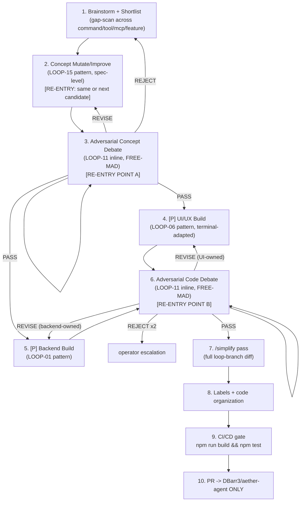

# Mission

Grow `aether-agent`'s capability surface (slash commands, CLI commands, MCP
integrations, or standalone features) through a disciplined genesis pipeline
instead of an ad hoc "add a command" patch. The loop ideates against the
repo's *actual* gaps (not invented busywork), hardens the winning concept
through a tight re-entrant **mutate (LOOP-15 pattern) ⇄ adversarial-debate
(LOOP-11 inline, FREE-MAD)** cycle until the spec itself is attack-hardened,
then builds it on two tracks running **in sync**: the terminal UI/UX surface
(LOOP-06 pattern, adapted for a TUI — same substitution AA-LOOP-01 made: no
Playwright/viewports, PTY-drive + static read instead) and the backend
contract (LOOP-01 pattern — core module, MCP wiring, tool-executor surface).
The combined diff then re-enters a second adversarial cycle (LOOP-11 again)
that treats **the review node as the sole re-entry point**, mirroring the
Kernel's own recovery rule (PROTOCOL.md §7: "Node 11 fails → resume at node
11, never node 1") exactly as AA-LOOP-01 established for this repo. Only
after both cycles clear does the loop simplify, organize, gate on CI, and
PR — it never merges itself.

This loop's mutation surface is **application code** (`src/commands/*`,
`src/core/*`, `src/ui/*`, `test/*`, `COMMANDS.md`), a deliberate scope
difference from the source LOOP-15, whose mutation surface is restricted to
loop files only — the same distinction AA-LOOP-01 already drew for this repo,
carried forward here. It is also a distinct lane from `AA-LOOP-02` (agent-
runtime security audit, LOOP-04 pattern): that loop hardens capabilities the
runtime already has; this loop invents and ships new ones.

# Trigger (when the operator runs this)

- On demand: `Run AA-LOOP-03 on aether-agent`.
- On demand with a pre-picked concept, skipping node 1: `Run AA-LOOP-03 on
  aether-agent --candidate "<one-line feature idea>"`.
- Periodic cadence, operator's choice (e.g. monthly capability-growth pass) —
  this loop is additive/exploratory, not a bugfix cycle, so it has no natural
  "after any change to X" trigger the way AA-LOOP-01/02 do.
- Any new command/tool/MCP surface this loop ships becomes, in turn, part of
  the baseline `AA-LOOP-02` audits on its next run (new `ToolExecutor`
  capability → `gateActionFor` exhaustiveness check) — a downstream trigger
  for that loop, not this one.

# Inputs (target repo/dir, scope flags)

- `target`: `aether-agent` repo root (`https://github.com/DBarr3/aether-agent`).
- `scope`: default full repo; write surface bounded to `src/commands/*`,
  `src/core/*`, `src/ui/*`, `test/*`, `COMMANDS.md`, `docs/loops/`
  (this file's own directory, artifact-only).
- `existing_surface`: `COMMANDS.md`, `src/commands/slash_registry.ts`
  (`SLASH_COMMANDS` table + `SLASH_SECTIONS`), `src/core/mcp.ts` +
  `src/core/mcp_store.ts` (MCP catalog/wiring), `src/core/tool_executor.ts`
  (tool surface) — node 1's dedup baseline; a candidate that duplicates an
  existing row is DOA, not a finding to fix.
- `--category <command|tool|mcp|feature>`: restrict brainstorming to one
  category (default: all four).
- `--candidate <text>`: operator supplies the concept directly; node 1
  becomes a dedup/feasibility check on the supplied idea instead of open
  brainstorming, then hands straight to node 2.
- `--max-candidates <n>`: shortlist size at node 1 (default 5).
- `--skip-mutate`: for a trivial/obvious candidate, allow node 2 to run once
  without the full re-entrant cycle (still passes through node 3 once —
  never skips adversarial review itself).

# Preconditions

- Loop branch `loop/AA-LOOP-03-<YYYY-MM-DD>` created from `origin/main`.
- Baseline green: `npm install && npm run build && npm test` passes on
  `main` before node 1 starts (same gate AA-LOOP-01/02 require; this repo
  has no GitHub Actions — the test suite *is* CI/CD, per `CONTRIBUTING.md`).
- No runtime dependency additions without a maintainer's nod
  (`CONTRIBUTING.md` — zero-runtime-dep is a stated feature); a candidate
  concept requiring one is flagged at node 1, not discovered at node 4/5.
- No secrets/tokens/internal hostnames introduced; `aether-agent` talks to
  the public Aether API and nothing else (`CONTRIBUTING.md`).
- **High-risk-capability pre-screen:** any candidate whose backend would grant
  new execution, filesystem-beyond-cwd, network, or credential-handling
  privileges beyond what `src/core/tool_executor.ts` already exposes must be
  flagged by node 1 and held for **explicit operator approval before node 2
  starts** — concept refinement never proceeds on an unapproved high-risk
  candidate (fail-closed; see Approval Gates).
- No other AA-LOOP-03 run mid-flight for the same candidate (serialized per
  concept; unrelated candidates may run in separate branches).

# Execution DAG (numbered nodes, [P] = parallelizable)



1. Brainstorm + shortlist — scan the repo's real command/tool/MCP surface for
   gaps, generate candidates across all four categories, dedupe, rank, select
   one lead concept.
2. **[loop re-entry A]** Concept mutate/improve (LOOP-15 pattern) — turn the
   lead concept into a concrete mini-spec; each round improves on the prior
   round's critique.
3. **[loop re-entry point A]** Adversarial concept debate (LOOP-11 inline,
   FREE-MAD) — attacks the spec itself, before any code exists.
4. **[P]** UI/UX build (LOOP-06 pattern, terminal-adapted) — the command/
   slash-command surface, help text, TUI rendering.
5. **[P]** Backend build (LOOP-01 pattern) — the core module, MCP wiring if
   applicable, tool-executor surface, unit tests.
6. **[loop re-entry point B]** Adversarial code debate (LOOP-11 inline,
   FREE-MAD) — attacks the combined UI+backend diff.
7. `/simplify` pass over the full loop-branch diff.
8. Labels + code-organization pass.
9. CI/CD gate — full build+test suite.
10. PR — opened against `aether-agent` only.

**Two separate re-entrant cycles, chained, never merged into one:** nodes
2⇄3 harden the *spec* (no code yet — cheap to iterate, cheap to kill a bad
concept and fall back to node 1's next-ranked candidate on REJECT). Nodes
4/5⇄6 harden the *implementation* against that already-hardened spec. Node 6
is deliberately smarter than a flat loop-back: a REVISE verdict is routed to
**whichever track owns the flaw** (a UI-only defect returns to node 4, a
backend-only defect to node 5, a contract mismatch between them returns to
both). This is the same discipline as AA-LOOP-01's "review node is the sole
re-entry point" rule, extended to two tracks instead of one.

# Node Specs

**Node 1 — Brainstorm + shortlist.**
Action: read `COMMANDS.md`, `src/commands/slash_registry.ts`'s
`SLASH_COMMANDS`/`SLASH_SECTIONS`, `src/core/mcp.ts` + `src/core/mcp_store.ts`
(what MCP servers/tools are already wired), and `src/core/tool_executor.ts`
(what the agent can already do) as the existing-surface baseline. Generate
raw ideas across all four categories (unless `--category` narrows it):
new slash/CLI command, new agent tool, new MCP integration, standalone
feature. Every idea is checked against the baseline — a duplicate of an
existing row is discarded at this node, not carried forward as a "finding"
for node 3 to catch. Score survivors on value (does it close a real gap a
user would hit), feasibility (buildable within the zero-runtime-dep,
~300-line-file constraints), and novelty (not a reskin of an existing
command). Shortlist the top `--max-candidates` (default 5), then select the
single highest-scoring one as the lead concept — the rest are recorded, not
discarded, so a node-3 REJECT can fall back to the next-ranked candidate
without re-running node 1 from scratch. If `--candidate` was supplied, skip
generation; run only the dedup/feasibility check against the supplied idea.
**High-risk-capability flag:** any candidate implying new exec/filesystem-
beyond-cwd/network/credential privileges is marked `NEEDS-OPERATOR-APPROVAL`
and the loop pauses here — it does not advance to node 2 unapproved.
Tools: Read, Grep (`SLASH_COMMANDS`, `mcp_store.ts` catalog), `gh issue list`
(if the operator wants open issues considered as candidate sources).
Failure conditions: zero candidates survive dedup → HALT, report to operator
(this is signal the repo's surface is already dense, not a loop defect);
all shortlisted candidates flagged `NEEDS-OPERATOR-APPROVAL` → HALT pending
operator sign-off on at least one.
Output artifact: `_loopstate/AA-LOOP-03/<run-id>/node-1-shortlist.md` (id |
category | one-line pitch | value/feasibility/novelty scores | dedup check |
risk flag) + confidence block.

**Node 2 — Concept mutate/improve (re-entry A).**
Action: generalizes LOOP-15's mutate/improve mechanic (root-cause → fix →
generalized pattern) to a pre-code spec: take the lead concept and produce a
concrete mini-spec — one-paragraph user story, exact CLI/slash-command
surface (name, args, flags, aliases, which `SLASH_SECTIONS` bucket) or MCP
tool schema, backend contract (which `src/core/*` module owns the logic,
inputs/outputs, error cases), a UX sketch (what the terminal shows), and an
explicit non-goals list. On re-entry from a node-3 REVISE, incorporate the
critique verbatim into the next round's spec — no repeating a rejected
approach unchanged.
Tools: Read (existing command/module patterns to match repo idiom), Write
(spec draft), no code changes yet.
Failure conditions: spec cannot express a testable exit condition (Node
3 needs one) → HALT node, redraft with an explicit "how would we know this
is done and correct" section.
Output artifact: `node-2-spec-round-<n>.md` (spec + confidence block).

**Node 3 — Adversarial concept debate (re-entry point A).**
Action: FREE-MAD, inline mode, hostile persona (see Adversarial Check
below), attacking the spec — not code, since none exists yet. PASS routes to
nodes 4+5 in parallel. REVISE returns to node 2 with the critique. REJECT
(concept is fundamentally unsound, not merely underspecified) returns to
node 1 to promote the next-ranked shortlisted candidate — the whole loop
does not restart from a blank brainstorm.
Tools: Read, Grep (cross-check spec claims against real files), reasoning
tier for the feasibility/security verdict.
Failure conditions: reviewer cites no evidence → critique void, forces one
more round (silent-agreement guard, PROTOCOL.md §11); REJECT on every
shortlisted candidate in turn → HALT, report to operator that no candidate
in this run's shortlist survived, recommend a fresh node-1 pass with
different scope/category.
Output artifact: `node-3-concept-review-round-<n>.md` (verdict, score, cited
evidence) + QOPC confidence block.

**Node 4 — [P] UI/UX build (LOOP-06 pattern, terminal-adapted).**
Action: build the command's user-facing surface per the hardened node-2/3
spec: add the entry to `SLASH_COMMANDS` in `src/commands/slash_registry.ts`
(name, args, summary, correct `section`) if it's a slash command; wire the
matching case in the `handleSlash` switch (the repo has an existing test
asserting registry/switch stay in sync — extend it, don't bypass it); add
any TUI rendering (`src/ui/*`) the spec's UX sketch calls for; update
`COMMANDS.md`. Terminal-adapted LOOP-06 substitutions (same as AA-LOOP-01):
no Playwright/viewports/themes; state coverage (help text correctness, Tab-
completion inclusion, did-you-mean matching) verified by static read plus,
where needed, a scripted PTY drive (`node-pty` spawning `dist/src/main.js`).
Tools: Read, Edit, Write (new command file under `src/commands/` if the
feature warrants its own, following the one-file-per-command layout),
`node-pty` (optional, PTY drive), Bash (`npm run build`).
Failure conditions: spec's UX sketch is unbuildable without a runtime dep →
HALT node, surface to operator (needs maintainer nod).
Output artifact: `node-4-ui-build.md` (files touched, registry diff, help-
text diff) + one commit (`loop(AA-LOOP-03): node-4 — <concept> UI/UX`).

**Node 5 — [P] Backend build (LOOP-01 pattern).**
Action: build the concept's backend contract per the hardened spec: new or
extended `src/core/*` module; if the concept is an MCP integration, wire it
through `src/core/mcp.ts`/`src/core/mcp_store.ts`'s existing catalog
pattern; if the concept is a new agent tool, extend `src/core/tool_executor.ts`'s
tool surface; write unit tests under `test/` matching the repo's existing
bar (stream decoder, catalog parsing, arg resolution are all unit-tested —
`CONTRIBUTING.md`: "match that bar"). Runs concurrently with node 4 — both
consume the same node-3 PASS spec, neither waits on the other.
Tools: Read, Edit, Write (module + tests), Bash (`npm run build`,
`node --test`), ast-grep (verify the new module doesn't duplicate an
existing helper).
Failure conditions: new runtime dependency required → HALT node, surface to
operator; new module would push a touched file over ~300 lines → flag for
node 8, don't block here.
Output artifact: `node-5-backend-build.md` (files touched, test paths, new
module summary) + one commit (`loop(AA-LOOP-03): node-5 — <concept> backend`).

**Node 6 — Adversarial code debate (re-entry point B).**
Action: FREE-MAD, inline mode, hostile persona, reviewing nodes 4+5's
*combined* diff together (not each track in isolation — a contract mismatch
only shows up when both sides are read at once: e.g. the slash command
calls a backend function with a different argument shape than node 5 built).
Also re-verifies: does the new test actually reproduce/prove the feature
(fails on the pre-feature commit, passes after); does the new command
regress `SLASH_COMMANDS`/`handleSlash` sync; is the security posture of any
new tool/MCP surface acceptable (arbitrary-exec, path traversal, unbounded
network calls); zero-runtime-dep respected. Verdict PASS routes to node 7.
REVISE is routed to **whichever track owns the flaw** — UI-only defect back
to node 4, backend-only defect back to node 5, contract mismatch to both.
REJECT twice on the same finding escalates to the operator rather than
killing the whole feature silently.
Tools: Grep/ast-grep, Read, Bash (re-run the new/changed tests against pre-
and post-feature commits).
Failure conditions: reviewer cites no evidence → critique void, forces one
more round; REJECT×2 → operator escalation with both tracks' current state
preserved on the branch, loop pauses (not a full HALT of the run, but no
further automated progress on this finding).
Output artifact: `node-6-code-review-round-<n>.md` (verdict, score, cited
evidence, which track it routes to) + QOPC.

**Node 7 — `/simplify` pass.**
Action: once node 6 reports PASS, invoke the `/simplify` Claude Code skill
over the full loop-branch diff (`git diff origin/main...HEAD`). Quality-only
— reuse, simplification, efficiency, altitude cleanup across everything both
tracks touched. Does not hunt new bugs (nodes 3/6 already did that).
Tools: `/simplify` skill, Bash (`git diff`).
Failure conditions: `/simplify` proposes a change that alters behavior (not
pure cleanup) → routes back to node 4 or 5 (whichever file it touches) as a
new mini-finding, never applied silently under the simplify banner.
Output artifact: `node-7-simplify.md` (changes applied, changes deferred
with why).

**Node 8 — Labels + code organization.**
Action: (a) for every file touched across both tracks, verify it still
respects `CONTRIBUTING.md`'s "~300 lines, one job each" guideline; split any
file that crossed the threshold (note: `src/core/workflow.ts` is already
near/over this bound independent of this loop — do not conflate a pre-
existing over-length file with one this loop pushed over the line; only
split what this loop's own diff caused or worsened); (b) assign PR labels:
domain (`feature`, plus `ux`/`backend`/`mcp` as applicable), risk
(`branch-mutating`), category (`command`/`tool`/`mcp`/`feature`, matching
node 1's classification) — created ad hoc via `gh label create` if missing,
reusing AA-LOOP-01/02's label names where the domain overlaps (`ux`).
Tools: Read, Edit, Bash (`gh label list`, `gh label create` if needed,
`wc -l`).
Failure conditions: a needed split would touch code outside this loop's
scope → surface to operator as a follow-up item, don't silently expand
scope.
Output artifact: `node-8-organize.md` (files split, labels applied).

**Node 9 — CI/CD gate.**
Action: `npm run build && npm test` on the final loop-branch state — this
repo's actual and only CI/CD gate (no GitHub Actions configured, same as
AA-LOOP-01/02). Must be green with zero regressions against the pre-loop
baseline test count, and the new feature's tests must be present and
passing.
Tools: Bash.
Failure conditions: red → HALT, do not proceed to node 10; route the
failing test(s) back to node 4 or 5 (whichever owns the failing area) as
new findings.
Output artifact: `node-9-ci.md` (full test output, pass count before/after).

**Node 10 — PR.**
Action: open a pull request against `DBarr3/aether-agent`, base `main`,
from `loop/AA-LOOP-03-<date>`. Body includes: the winning concept + shortlist
context (why this one, what else was considered), the hardened spec, diffs
applied (commit list from both tracks), tests generated, `/simplify`
summary, final QOPC, governance row. **This loop opens PRs in `aether-agent`
only — it MUST NOT create branches, commits, or PRs in `agentic-loops` or
any other repository,** even though this spec's structure and shared
vocabulary (QOPC, DAG, Execution Protocol) are drawn from that project's
Kernel; the two repos are kept strictly separate (same hard boundary
AA-LOOP-01/02 established).
Tools: Bash (`gh pr create`).
Failure conditions: node 9 not green → this node cannot run (hard
dependency).
Output artifact: PR URL + `AUDIT-ARTIFACT.md` (standard loop artifact shape)
attached to the PR description.

# Adversarial Check (reviewer persona + what it attacks)

**Stage A — concept debate (node 3).** Persona: **skeptical product
reviewer fused with a security architect** — someone who has watched teams
ship a "cool" command nobody uses, and someone who assumes every new tool
surface is an attack surface until proven otherwise. It attacks:

1. Redundancy — is this genuinely not a reskin of an existing
   `SLASH_COMMANDS` row or `mcp_store.ts` entry (demands the actual diff
   against node 1's dedup check, not the claim that one was done)?
2. Value honesty — is the "user story" a real gap, or a solution in search
   of a problem? Demands a concrete scenario, not a generic one.
3. Zero-runtime-dep and ~300-line-file feasibility — can this actually be
   built inside this repo's stated constraints, or does the spec quietly
   assume a dependency?
4. Security surface — for tool/MCP concepts specifically: what new
   privilege does this grant the agent (exec, filesystem, network,
   credentials), and did node 1's high-risk flag correctly catch it?
5. QOPC `unknown` list first, always (PROTOCOL.md §3).
6. Silent Agreement — an unevidenced round-1 PASS forces one hostile round
   before acceptance (PROTOCOL.md §11).

**Stage B — code debate (node 6).** Persona: **ruthless terminal-UX
pentester fused with a skeptical senior backend reviewer** (the same
fusion AA-LOOP-01 uses for its UX work, extended to also demand backend
rigor). It attacks:

1. Contract fidelity between tracks — does the UI's call site actually
   match the backend's function signature, error shape, and return type
   (reads both files together, never one in isolation)?
2. Test honesty — does the new/changed test fail on the pre-feature commit
   and pass on the post-feature commit? A test green on both proves nothing.
3. Registry/switch sync — for a new slash command, does the existing sync
   test still pass, and does it actually cover the new entry (not just not
   fail)?
4. Regression on adjacent commands — does the new backend module share a
   `core/*` file with anything else, and if so, was that shared surface
   re-verified?
5. Security re-check of the built (not just spec'd) surface — does the
   actual implementation match the privilege scope node 3 approved, or did
   it quietly grow (scope creep between spec and code is treated as a fresh
   finding, not a formality)?
6. Silent Agreement — same guard as stage A.

Maximum 2 debate rounds per stage (protocol default), 4 hard max on
contested findings; REJECT×2 at stage A falls back to the next shortlisted
candidate; REJECT×2 at stage B escalates to the operator rather than
blocking the whole run.

# Exit Criteria (quantitative, overrides protocol §12)

- Node 1 selected exactly one lead concept with a recorded shortlist and
  dedup check; zero duplicate-of-existing-surface candidates advanced.
- Node 3 (concept debate) exits with PASS and confidence ≥ 0.85 before any
  code is written — a REVISE/REJECT loop that never reaches PASS terminates
  the run as `FAIL-with-artifact`, not silent abandonment.
- Node 6 (code debate) exits with PASS and confidence ≥ 0.85 on the
  *combined* UI+backend diff, with zero unresolved CRITICAL/HIGH findings
  and zero un-routed REVISE items.
- 100% of new logic (both tracks) has a test proven RED on the pre-feature
  commit and GREEN on the post-feature commit.
- The registry/switch sync test (if the concept added a slash command)
  passes and demonstrably covers the new entry.
- `npm run build && npm test` green at node 9, with test count ≥ pre-loop
  baseline + the new feature's tests (no test silently removed to pass).
- Zero files touched left over the repo's ~300-line guideline without an
  operator-flagged exception (and no conflation with pre-existing over-
  length files this loop didn't cause).
- Zero new runtime dependencies without an explicit maintainer nod recorded
  in the PR.
- `/simplify` pass completed with zero unresolved behavior-altering
  proposals smuggled in as cleanup.
- Final QOPC confidence ≥ 0.85 at handoff; governance row written.
- Exactly one PR opened, targeting `DBarr3/aether-agent` — zero writes of
  any kind to `agentic-loops` or any other repository.

# Failure Routing (only deviations from protocol §4)

- **Concept-stage re-entry (nodes 2⇄3) is exclusively node 3's call:**
  REVISE → node 2; REJECT → node 1 (next candidate). Node 2 never
  self-decides to advance to code.
- **Code-stage re-entry (nodes 4/5⇄6) is exclusively node 6's call, and is
  track-routed:** a UI-only flaw returns to node 4, a backend-only flaw to
  node 5, a contract mismatch to both. Neither track restarts the other
  unprompted.
- Security Failure classification (Kernel §4) applies immediately if a
  candidate's actual implementation (node 4/5) grants a privilege beyond
  what node 1's high-risk screen approved, or beyond `tool_executor.ts`'s
  existing scope in any way not explicitly spec'd at node 2/3 — HALT,
  CRITICAL artifact, human approval required before continuing.
- A candidate REJECTed at every position on the node-1 shortlist (stage A)
  is a HALT with a full report, not a fabricated "PASS" on a weak concept
  just to keep the loop moving.

# Approval Gates (only deviations from protocol §10)

- Kernel/protocol defaults apply (read/audit automatic; branch-mutating work
  needs adversarial sign-off; merge is operator-only).
- **High-risk-capability gate (pre-node-2):** any candidate flagged
  `NEEDS-OPERATOR-APPROVAL` at node 1 (new exec/filesystem-beyond-cwd/
  network/credential privilege) is held for explicit operator approval
  before concept refinement starts — fail-closed, no exceptions.
- **Repository boundary is a hard approval gate:** node 10 may only target
  `DBarr3/aether-agent`. Any accidental targeting of `agentic-loops` (or any
  other repo) is a Permission Failure (Kernel §4) — HALT, surface to
  operator, never self-correct by silently retargeting.
- New runtime dependency proposals (node 1 flag, node 5 discovery) always
  require explicit maintainer approval before landing, per
  `CONTRIBUTING.md`.

# RUN PROMPT

```
Run AA-LOOP-03 on aether-agent.
Follow C:\Users\lilbe\Documents\GitHub\aether-agent\docs\loops\AA-LOOP-03-feature-genesis-mutate-adversarial.md.
Brainstorm a new command, tool, MCP integration, or feature grounded in this
repo's real gaps (COMMANDS.md, slash_registry.ts, mcp.ts/mcp_store.ts,
tool_executor.ts) — no duplicates of existing surface. Shortlist candidates,
pick one lead concept, flag any high-risk-capability candidate for my
approval before proceeding. Harden the concept spec through a paired
mutate(LOOP-15 pattern)/adversarial-debate(LOOP-11, FREE-MAD) cycle — the
review node is the sole re-entry point — until PASS. Then build it on two
parallel tracks: UI/UX (LOOP-06 pattern, terminal-adapted) and backend
(LOOP-01 pattern), each with regression tests. Re-verify the combined diff
through a second adversarial-debate cycle (LOOP-11 again), routing REVISE
to whichever track owns the flaw, until PASS. Then run /simplify over the
full diff, verify file-size/labels hygiene, confirm
`npm run build && npm test` green, and open exactly one PR against
DBarr3/aether-agent (main). Never touch the agentic-loops repository. No
merge without my approval.
```
